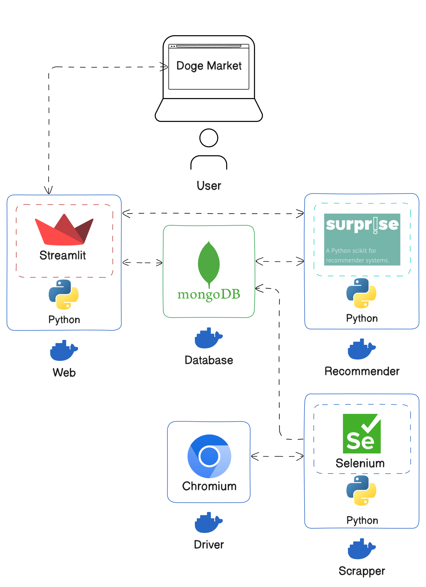

# Doge Market

## Table of Contents

- [Doge Market](#doge-market)
  - [Table of Contents](#table-of-contents)
  - [About](#about)
    - [Author](#author)
    - [Description](#description)
  - [Architecture](#architecture)
    - [Data](#data)
    - [Web](#web)
    - [Recommender](#recommender)
      - [Collaborative Filtering](#collaborative-filtering)
      - [Content-Based Filtering](#content-based-filtering)
  - [Tech stack](#tech-stack)
    - [Continuous Integration and Continuous Deployment](#continuous-integration-and-continuous-deployment)

## About

### Author

[Alejandro Uribe](https://uribealejandro.github.io/) Chemical Engineer from [`Universidad Nacional de Colombia`](https://unal.edu.co/), Specialist in Artificial Intelligence from [`Universidad Nacional de Colombia`](https://unal.edu.co/) and student of the [`Master in Data Mining & Knowledge Discovery`](https://datamining.dc.uba.ar/) at [`Universidad de Buenos Aires`](https://www.uba.ar/).

### Description

`Doge Market` is an e-commerce like website, this is the final project for the course [`Recommender Systems - Fall 2024`](https://datamining.dc.uba.ar/datamining/sistemas-de-recomendacion/), taught by `Roberto Abalde`. The course is part of the [`Master in Data Mining & Knowledge Discovery`](https://datamining.dc.uba.ar/) at [`Universidad de Buenos Aires`](https://www.uba.ar/).

The project stated that the final product should be a web application that allows users to see products for their pets, the data must come from a real source, that was scrapped for the sake of the project. Finally, the website should have a recommender system that suggests products to users based on their behavior on the website.

## Architecture

The project was developed using a microservices architecture, the project is divided into three main components: `Data`, `Web`, and `Recommender`. The components are independent and can be deployed separately, the communication between the components is done through the database, in this case, `MongoDB`

1. **Data**:
   1. **Scraper**: Python script to scrape the data from the website.
   2. **Driver**: Remote `Selenium` driver to scrape the data.
   3. **Database**: `MongoDB` database to store the data.
2. **Web**: `Streamlit` web application to display the data and recommendations.
3. **Recommender**: `Recommender` system to suggest products to users.

All the services and their networking are shown in the following diagram:

### Data

The data is scraped from the website [`Shein`](https://us.shein.com/), then it is stored in a `MongoDB` database. The library `Selenium` for Python is used to scrape the data. There is a `Docker` container running the `Selenium` driver that is used to scrape the data.

A `MongoDB` database is running in another `Docker` container, the data is stored in the database. The data is stored in three collections:

1. **Product URL**: Contains the URLs of the products. This is the initial data that is scraped, the data is then used to scrape the rest of the information. None of the services use this data.
2. **Product Details**: Contains the information of the products.
3. **Product Reviews**: Contains the reviews of the products.

Further collections are added by other services to store the user login information, user behavior on the website and the recommendations.

### Web

The `Web` service is a `Streamlit` web application that displays the products and recommendations to the users. The web application is deployed in a `Docker` container. The web application uses the `MongoDB` database to display the products and recommendations.

It also holds communication with the `Recommender` service to get the recommendations for the users and to store the user behavior in the database.

### Recommender

After the data is stored in the database, the `Recommender` service uses the data to suggest products to users. The collaborative filtering and content-based filtering algorithms are used to suggest products to users.

The recommendations are based on the user's behavior on the website. The system uses the `Collaborative Filtering` and `Content-Based Filtering` algorithms to suggest products to users.

#### Collaborative Filtering

#### Content-Based Filtering

## Tech stack

- Python
- Streamlit
- MongoDB
- Docker
- Google Cloud Platform
- GitHub Actions

### Continuous Integration and Continuous Deployment

The project is deployed on `Google Cloud Platform` using `Docker` containers. The deployment is done using `GitHub Actions` and the `Docker` images are stored in the `Google Cloud Platform` container registry.
