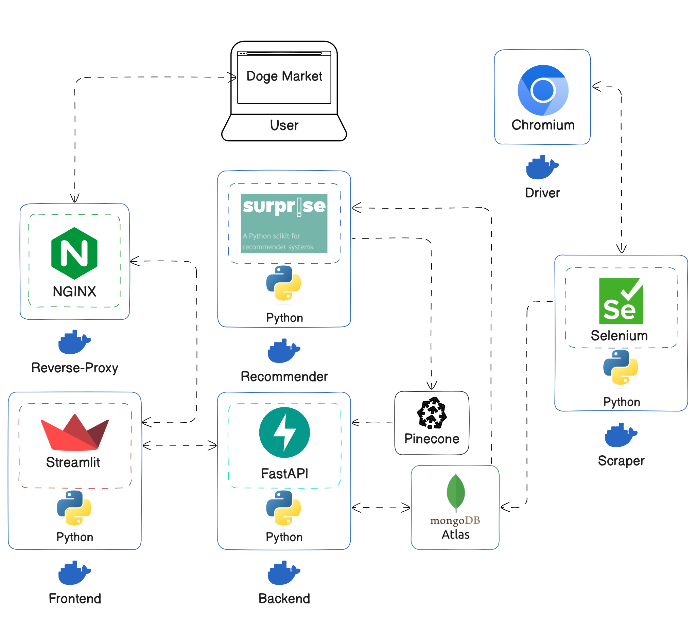

# Doge Market <!-- omit in toc -->

[](https://github.com/UribeAlejandro/Recommender_System/actions/workflows/ci.yml)

## Table of Contents <!-- omit in toc -->

- [Installation](#installation)
  - [Environment Variables](#environment-variables)
  - [Docker](#docker)
  - [Local](#local)
- [Description](#description)
- [Architecture](#architecture)
  - [Scraper](#scraper)
  - [Web](#web)
  - [Recommender](#recommender)
  - [Continuous Integration](#continuous-integration)
    - [Tests](#tests)

## Installation

### Environment Variables

Add the `.env` file to the root of the project with the following content:

```bash
FRONTEND_PORT=8501
BACKEND_PORT=8000
BACKEND_URL="http://backend:$BACKEND_PORT"
MONGO_DATABASE="shein"
MONGO_URI=...
PINECONE_INDEX_NAME=...
PINECONE_API_KEY=...
```

### Docker

You need `Docker` and `Docker Compose` installed to run the project.  Run the following command to scrape the data:

```bash
docker-compose -f docker-compose-scrapper.yml up --build
```

Run the following command to start the web application:

```bash
docker-compose up --build
```

### Local

You can create a virtual environment and install the dependencies:

```bash
make venv
```

Then, activate the virtual environment:

```bash
source venv/bin/activate
```

Install the dependencies:

```bash
make install
```

Run the following command to scrape the data:

```bash
python -m scraper.main
```

Run the following command to start the `backend`:

```bash
fastapi run backend/main.py --proxy-headers --port 8000 --reload
```

Run the following command to start the web application:

```bash
streamlit run frontend/main.py
```

## Description

`Doge Market` is an e-commerce like website, this is the final project for the course [`Recommender Systems - Fall 2024`](https://datamining.dc.uba.ar/datamining/sistemas-de-recomendacion/), taught by `Roberto Abalde`. The course is part of the [`Master in Data Mining & Knowledge Discovery`](https://datamining.dc.uba.ar/) at [`Universidad de Buenos Aires`](https://www.uba.ar/).

The project stated that the final product should be a web application that allows users to see products for their pets, the data must come from a real source, that was scrapped for the sake of the project. Finally, the website should have a recommender system that suggests products to users based on their behavior on the website.

## Architecture

The project was developed using a microservices architecture, the project is divided into three main components: `Scraper`, `Web`, and `Recommender`. The components are independent and can be deployed separately. The microservices are deployed in `Docker` containers.

1. **Scraper**:
   - `Selenium` to scrape the data from the website.
   - `MongoDB` to store the data.
2. **Web**:
   - `NGINX` reverse proxy to handle the communication between the user and the web application.
   - `Streamlit` web application to display the data and recommendations.
   - `Backend` to handle the communication between the web application and the database.
3. **Recommender**: Builds offline recommendations.
   - `Collaborative Filtering` to suggest products to users.
     - `MongoDB` to store the recommendations.
   - `Content-Based Filtering` to suggest products to users.
     - Uses the a `Pinecone` index to store the embeddings of the products.

All the services and their networking are shown in the following diagram:



### Scraper

The `Scraper` service is shown in the following diagram:


Start the containers using the following command:

```bash
docker-compose -f docker-compose-scrapper.yml up --build
```

The previous operation can be time-consuming, so try to run it once. Once the data is scraped, the containers can be stopped using the following command:

```bash
docker compose -f docker-compose-scrapper.yml down -v
```

The data is scraped from the website [`Shein`](https://us.shein.com/), then it is stored in a `MongoDB` database. The library `Selenium` for Python is used to scrape the data. There is a `Docker` container running the `Selenium` driver that is used to scrape the data.

The file [docker-compose-scrapper.yml](docker-compose-scrapper.yml) handles the `Docker` containers that are used to scrape the data. oOn the other hand, The file [modules/shein/main.py](modules/shein/main.py) contains the code to scrape the data.

The data is stored in a `MongoDB` database. The data is stored in three collections:

1. **Product URL**: Contains the URLs of the products. This is the initial data that is scraped, the data is then used to scrape the rest of the information. None of the services use this data.
2. **Product Details**: Contains the information of the products.
3. **Product Reviews**: Contains the reviews of the products.

Further collections are added by other services to store the user information, user behavior on the website and the recommendations.

> Note that the diagram above shows a direct connection to `MongoDB Atlas`, which is the cloud database that is used to store the data. However, the `docker-compose` file uses a local `MongoDB` database to store the data. Then, the data might be migrated to the cloud database.
> Note that the `docker-compose` file uses the image `seleniarm/standalone-firefox:latest` for the driver. The ARM images are optimized for ARM processors as Apple Silicon. The image is used because the project is developed on an Apple Silicon machine. The image might not work on other systems. The base image must be changed to an image that matches your system, [here](https://hub.docker.com/u/selenium) for more information.

To migrate the data follow the next steps:

- A pre-process is done to the data, after the extraction. The script [shein/main.py](modules/shein/main.py) does so.
- Then, a second processing might be done. Open a `MongoDB` console and run the content of [database/scripts/etl.js](database/scripts/etl.js) to transform the data.

Migrate the data to the cloud database, start by accessing the `MongoDB` container:

```bash
docker-compose exec -it database bin/bash
```

Then, dump the data using the following command:

```bash
mongodump --host localhost --port 27017 --db shein --gzip
```

Then, to load the data to the cloud database use the following command:

```bash
mongorestore --uri mongodb+srv://<user>:<passowrd>@<x.x.mongodb.net> --gzip --nsInclude <collection-name>.* --nsTo=<collection-name>.*
```

More info [here](https://stackoverflow.com/questions/55785533/migrating-a-mongodb-on-a-local-machine-to-mongo-atlas).

### Web

The `Web` service is shown in the following diagram:


The diagram above shows that the user consumes the `Web` through a `NGINX` reverse-proxy. The reverse-proxy server is useful to serve the static files of the web application and to handle the communication between the user and the web application. Also, it adds a layer of security to the web application.

Start the containers using the following command:

```bash
docker-compose up --build
```

The previous operation can be time-consuming, so try to run it once. Once the data is scraped, the containers can be stopped using the following command:

```bash
docker compose  down -v
```

The `frontend` service is a `Streamlit` web application that displays the products and recommendations to the users. The web application is deployed in a `Docker` container. The web application gets all the information from the `backend` service. The `backend` service communicates with the `MongoDB` & `Pinecone` database to get the products and recommendations.

> Note that the `backend` service connects directly to the `MongoDB` & `Pinecone` databases in production, the local data that is scraped is stored in a local `MongoDB` database. The data might be migrated to the cloud database.
> Note that the `backend` service is the only service that connects to the databases. The `frontend` service does not connect to the databases.

### Recommender

The `Recommender` service builds the recommendations for the users. Three types of recommendations are shown to the users, depending on the way they are built:

- `The main 40`: The most popular products.
- `Content-based`: Similar products to the one the user is seeing ~ `Pinecone`*.
- `Collaborative filtering`: Products that the user might like ~ `MongoDB`**.

> *Note that the recommendations are built offline, the recommendations are stored in the database and then served to the user. The `Main 40` are not built offline, they are built on the fly as they can be built with a simple query to the database.

> **Note that the `Content-based` recommendations are built using the `Pinecone` service. The embeddings of the products are stored in the `Pinecone` index. The `Pinecone` service is used to get the similar products to the one the user is seeing. On the other hand, the `Collaborative filtering` recommendations are built by this service then stored and retrieved using the `MongoDB` database.  

> Note that the ratings are re-calculated for the collaborative-filtering recommendations, a HuggingFace [model](https://huggingface.co/nlptown/bert-base-multilingual-uncased-sentiment) is used to calculate the sentiment of the reviews. The sentiment is then used as the rating of the product.

### Continuous Integration

The project is set up with `GitHub Actions` for `Continuous Integration`. The `CI` pipeline builds the code and tests it.

#### Tests

The only service that is tested is the `backend` service that is a FastAPI application, and the `Pinecone` & `MongoDB` databases are pinged to check the connection. The tests are run using `pytest`.

To run the tests locally use the following command:

```bash
pytest tests/
```
